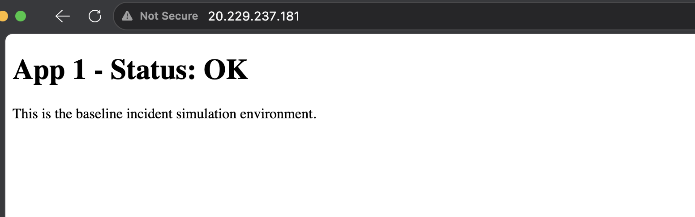

# Incident Report: [NSG Rule Change Causing HTTP Outage]

**Scenario #:** [e.g. 01]
**Date:** [22/06/2026]
**Environment:** [e.g. App 1 - baseline VM]
**Severity (self-assessed):** [High]
**Time to resolution:** [45 minutes planned - approx 10 minutes to resolve]

---

## 1. Ticket

TICKET#001 — Priority: High

Reported by: Sarah (Operations)

Time: 09:14
"Hi, we've just had a report from a customer that App 1 is completely unreachable. They were using it fine yesterday. Our monitoring dashboard is also showing it as down. Can you investigate and get it back up as soon as possible? No changes were scheduled overnight that I'm aware of."

## 2. Initial Triage

Located RG and App in Azure portal. Initialliy, I wanted to confirm if I could connect to the VM. 

## 3. Investigation

I checked the connection prerequisites that checks the NSG inbound rules. This confirmed port 22 SSH is configured, which I then realised, was not what I need. A customer would most likely be accessing via HTTP. I clicked view applied NSG rules and spotted HTTP inbound was denied. Changed rule to allow. Copied IP into browser and it returned a result.

## 4. Root Cause

NSG inbound rule for port 80 (HTTP) changed from Allow to Deny, blocking all inbound web traffic to the VM

## 5. Resolution

Updated the Allow-HTTP NSG inbound rule from Deny back to Allow via the Azure Portal

## 6. Verification

Confirmed change had applied and fixed the issue by accessing the VM via public IP in Edge.

## 7. What Was Actually Changed (Reveal)

The fault was a single Azure CLI command that changed the Allow-HTTP NSG rule from Allow to Deny — blocking all inbound traffic on port 80. Your diagnosis matched exactly.

## 8. Learning Notes

- What went well - resolution once found, was a quick fix and confirmation

- What took longer than expected, and why - I should have realised initialliy to check NSG HTTP rules, I saw SSH connection and wasted time thinking, lets check that. I felt I needed to be doing something, instead of taking a few seconds to think it through.

- Any hints used (Hint 1 / Hint 2 / Full walkthrough) and what they revealed - No hints required

- What you'd check first if this happened again
I would confirm via public IP, if I was able to access the VM. This rules out user issue. Then, look at NSG rules straight away to confirm Allow or Deny rule. With a better understanding of apps and how they are accessed and used, an engineer would be quicker at knowing the correct steps but I have the understanding to find the resolution.

- Prevention: how this could be avoided or caught sooner in a real environment
  (e.g. monitoring, alerting, change control)
Change control - this should be spotted in CAB before being implemented and would have prevented downtime.
An Azure Monitor alert on NSG rule changes or an HTTP availability test would have caught this within minutes automatically
---
*Part of an ongoing Azure incident simulation series — see [repo README] for context.*
